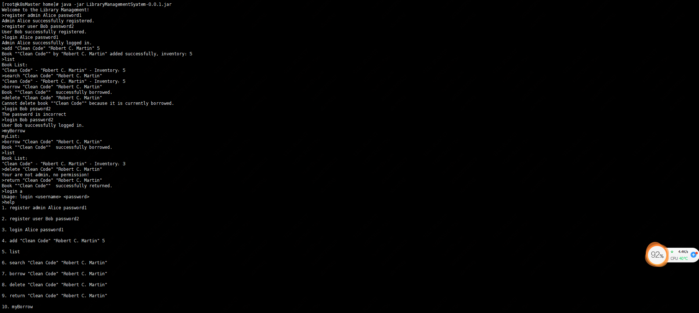

# 图书管理系统

这是一个简单的命令行图书管理系统，用于方便管理员和用户管理图书借阅情况。

## 功能特性

### 管理员功能

- **注册和登录：** 管理员可以注册新账户，并使用注册的账户登录系统。
- **图书管理：** 管理员可以执行以下操作：
    - 添加图书：输入图书的标题和库存数量，将图书添加到系统中。
    - 删除图书：通过图书的标题删除图书。
    - 查看图书列表：列出系统中所有图书的标题和库存数量。

### 用户功能

- **注册和登录：** 用户可以注册新账户，并使用注册的账户登录系统。
- **图书查询：** 用户可以执行以下操作：
    - 查看图书列表：列出系统中所有图书的标题和库存数量。
    - 搜索图书：通过输入关键字搜索图书，并显示匹配的图书列表。
- **图书借阅和归还：** 用户可以执行以下操作：
    - 借阅图书：通过输入图书的标题借阅图书，并更新库存数量。
    - 归还图书：通过输入图书的标题归还已借阅的图书，并更新库存数量。

## 技术实现

- **Java 编程语言：** 项目使用 Java 实现，具有良好的跨平台性和扩展性。
- **XML 数据持久化：** 使用 XML 文件保存图书、用户和借阅记录等数据，实现了简单的持久化功能。
- **代理模式：** 使用代理模式创建命令处理器的代理，提高了系统的可扩展性和可维护性。
- **单元测试：** 项目使用 JUnit 框架编写了单元测试，覆盖了系统的核心功能，确保功能的正确性和稳定性。

代码结构
-----------------------------------
```
项目结构
├─LibraryManagementSystem（主项目）
│  ├─annotation   注解，用于命令反射映射
│  ├─aspect       切面代理实现，代理命令处理器
│  ├─command      命令处理器，新增命令支持，则新增一个处理器
│  ├─entity       用户，图书，借阅等实体类
│  ├─enums        用户类型，命令要求枚举类
│  ├─repository   持久层代码，目前实现了本地xml文件的读写，支持扩展持久化方式
│  ├─server       主要服务接口，主要包含命令接收，登录用户管理，xml文件读写等基本内容
│  ├─service      服务层，包含对逻辑业务的具体处理，数据持久化管理等
│  ├─utils        工具类，包含日期，代码反射等工具类
```

## 快速开始

1. 克隆项目到本地：

  git clone https://github.com/HUSHIJIE0/LibraryManagementSystem.git

2. 打包项目

  mvn package

3. 运行系统：

  java -jar LibraryManagementSyatem-0.0.1.jar

4. 按照help命令行，按指引提示进行操作。



## 一些思考

- 不允许使用框架，代码使用基础的java语言编写，功能较为简单
- 考虑到重启项目不丢失数据，用xml实现数据持久化，但DOM操作较为繁琐，数据序列化复杂，因此实现持久化层接口，引入框架，可实现多种持久化方案
- 用户操作方面，用户的密码明文处理，未做加密，用户登录未做超时处理等
- 为了使新增命令具备易扩展，低侵入，实现了注解，反射，代理等编码操作，增加了代码的处理复杂度
- 当前设置的操作方式为，jar包启动后，直接进入命令行，不可后台执行（所有命令明文显示）；考虑如果应用，需要支持多终端远程接入，考虑支持telnet等方式接入
- 系统命令提示当前实现简单，直接用的系统输出
- 多终端带来的记录用户信息，并发处理，资源抢占等问题，在此版本中并未过多设计
- 

## 贡献者

- **作者：** Hu Shi Jie
- **联系方式：** hushijie2460@163.com
